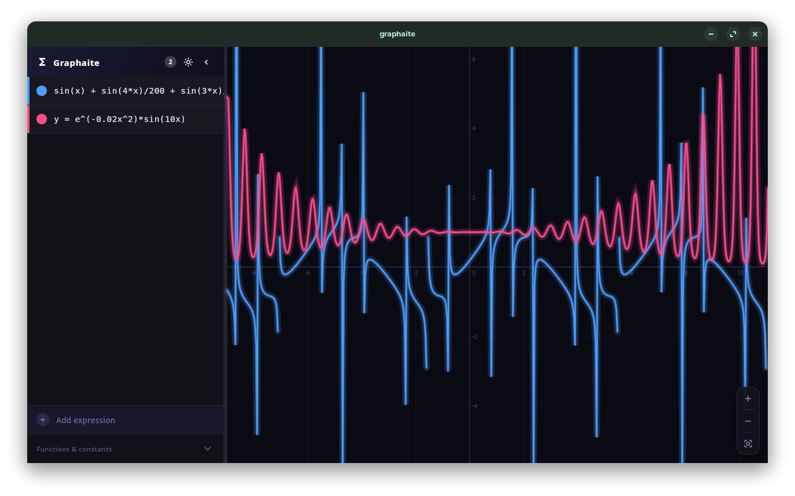
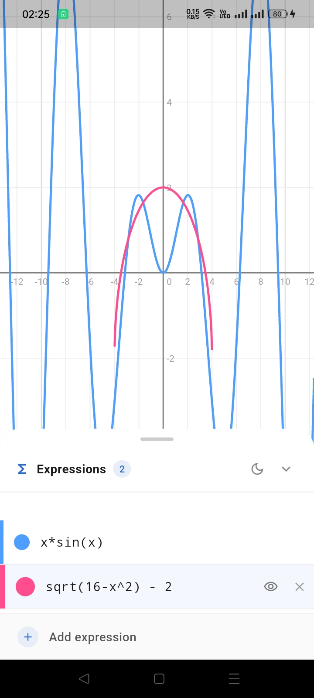

# Graphaite

A modern **Desmos-inspired graphing calculator** built with Flutter. This project demonstrates interactive mathematical function plotting using **Clean Architecture**, **BLoC state management**, and a responsive UI that works on desktop and mobile.

> This project focuses on architecture, performance, and maintainability while recreating the core graphing experience.

---

## 👇 Download

you can download from [release page](https://github.com/AbrarShakhi/graphaite/releases). 

You can also build from source. See below

---

## ✨ Features

* 📈 Plot multiple mathematical functions simultaneously
* ✏️ Live expression editing
* ✅ Expression validation
* 🎨 Individual graph colors
* 👁️ Toggle graph visibility
* ❌ Error detection for invalid expressions
* 🔍 Smooth zooming
* ✋ Pan across the coordinate plane
* 📱 Responsive interface

    * Desktop sidebar with resizable expression panel
    * Mobile draggable bottom sheet
* ⚡ Cached expression parsing for improved performance
* 🧩 Modular Clean Architecture

---

## 📸 Screenshots

| Desktop                 | Mobile                  |
| ----------------------- | ----------------------- |
|  |  |

---

# Architecture

The project follows **Clean Architecture** to separate responsibilities into independent layers.

### Data Layer

Responsible for external data and mathematical evaluation.

* Parses equations
* Evaluates functions
* Generates graph points
* Caches parsed expressions

### Domain Layer

Contains the application's business logic.

* Entities
* Repository contracts
* Use Cases

### Presentation Layer

Handles the UI and user interactions.

* BLoC state management
* Responsive layouts
* Graph rendering
* Expression editor

---

# Technologies

* Flutter
* Dart
* flutter_bloc
* GetIt
* math_expressions
* Equatable

---

# State Management

The application uses the **BLoC pattern**.

### ExpressionListBloc

Responsible for:

* Managing expressions
* Validation
* Add / Update / Delete
* Toggle visibility

### GraphBloc

Responsible for:

* Plot generation
* Viewport updates
* Graph redraws

---

# Dependency Injection

Dependencies are managed using **GetIt**.

Repositories, use cases, data sources, and BLoCs are registered through a centralized dependency container.

---

# Mathematical Engine

Function evaluation is powered by the `math_expressions` package.

Example expressions:

```
x
x^2
sin(x)
cos(x)
sqrt(x)
log(x)
exp(x)
```

Expressions are parsed once and cached to avoid unnecessary parsing during redraws.

---

# Graph Rendering

Each function is sampled across the current viewport.

The renderer:

* Converts equations into points
* Splits discontinuous graphs into separate line segments
* Ignores invalid or non-finite values
* Prevents drawing outside the visible viewport

---

# Responsive Design

## Desktop

* Resizable expression sidebar
* Collapsible panel
* Large graph viewport

## Mobile

* Draggable bottom sheet
* Gesture-friendly controls
* Optimized graph area

---

# Performance

Several optimizations are implemented:

* Cached parsed expressions
* Immutable entities
* Efficient BLoC rebuilds
* Segmented graph rendering
* Dependency injection with lazy singletons
* Repository abstraction
* Unmodifiable collections where appropriate

---

# Getting Started

Clone the repository:

```bash
git clone https://github.com/yourusername/flutter-desmos-clone.git
```

Install packages:

```bash
flutter pub get
```

Run the application:

```bash
flutter run
```

---

# Future Improvements

* Parametric equations
* Polar coordinates
* Sliders
* Function tables
* Graph labels
* Implicit equations
* Piecewise functions
* Save/load graphs
* Export graph as image
* Custom themes
* Keyboard shortcuts

---

# Learning Goals

This project was created to explore:

* Clean Architecture
* Flutter BLoC
* Mathematical expression parsing
* Interactive canvas rendering
* Responsive Flutter UI
* Dependency Injection
* Scalable application design

---

# License

This project is available under the [MIT License](LICENSE).

# Credits

* Icon: <a href="https://www.flaticon.com/free-icons/sea" title="sea icons">Sea icons created by Yobany_MTOM - Flaticon</a>